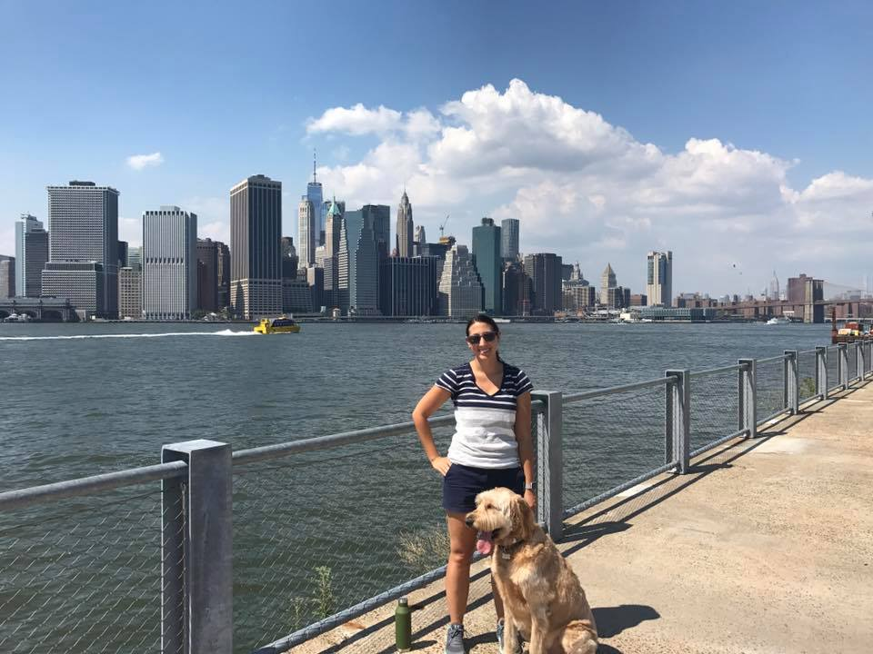

```{r setup, include=FALSE}
knitr::opts_chunk$set(echo = TRUE)
```

## About Me



I am an Assistant Professor of Mathematics at Middlebury College in VT. I typically work on problems in mathematical neuroscience, with a particular focus on using models and simulation to uncover plausible mechanisms underlying interesting biologically-observed phenomena. I have also worked on problems in epidemiology, criminal justice, and chronic pain.

I earned my B.S. in applied mathematics (2012) from Marist College, a small
liberal arts school in my hometown of Poughkeepsie, NY. From there, I went for my Ph.D. in mathematics (2017) at Rensselaer Polytechnic Institute under the advisement of Gregor Kovacic (RPI) and David Cai (NYU). After that, I had an NSF Postdoctoral Fellowship at the Courant Institute at NYU where I worked with David McLaughlin on modeling the developing visual cortex. See the Research Interests page for more details on my research interests.

I enjoy talking about my research, sharing ideas, and learning new mathematical techniques. When I’m not doing math, or talking about math, I enjoy hiking with my dog Gale, exploring new areas, and trying new food and restaurants.
