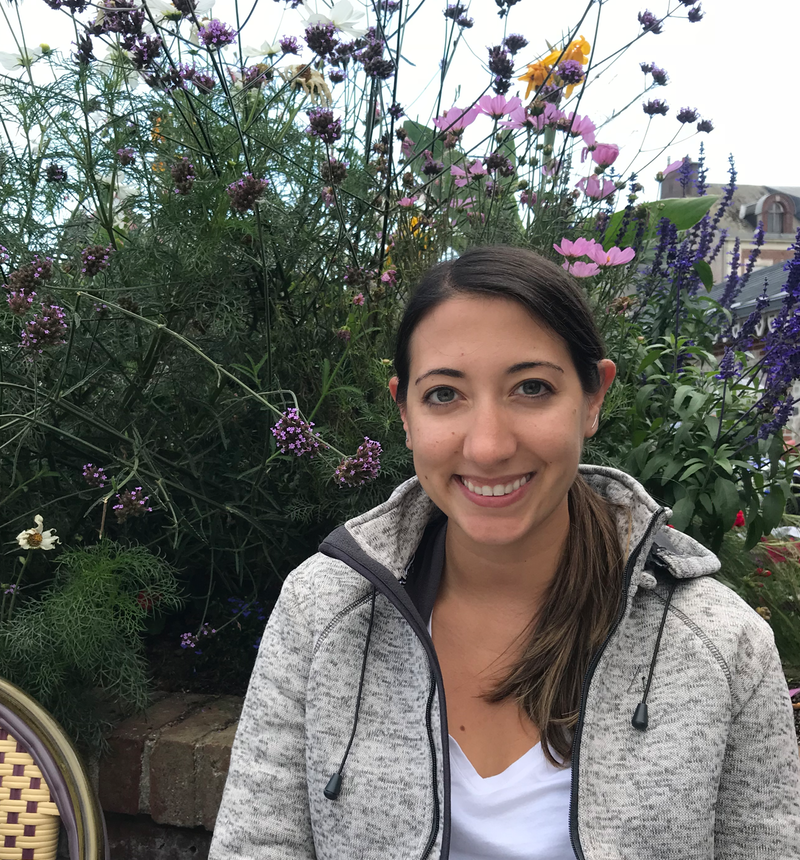

## About me

I am currently an **Assistant Professor of Mathematics** at Middlebury College, a small liberal arts school in Middlebury, VT. 

I am an applied mathematician interested in using mathematical modeling and computer simulation to explore problems in neuroscience and uncover plausible mechanisms underlying biologically observed phenomena. I have also worked on problems in epidemiology, criminal justice, and chronic pain.

When not working on mathematical models, I enjoy reading and exploring the outdoors with my family! 

---

<!-- ### Research Interests -->
<!-- * **Mathematical Neuroscience:** Spontaneous activity waves, synaptic plasticity, & cortical development -->
<!-- * **Pain Processing:** Modeling spinal cord dynamics, allodynia, & circadian pain sensitivity -->
<!-- * **Applied Modeling:** Multi-scale dynamics in epidemiology and social systems -->

<!-- --- -->

## Education

* **Ph.D. in Mathematics**, Rensselaer Polytechnic Institute (RPI), 2017
  * *Dissertation Advisors:* Dr. Gregor Kovačič and Dr. David Cai
* **NSF Postdoctoral Fellow**, Courant Institute of Mathematical Sciences (NYU), 2017–2020
  * *Mentor:* Dr. David McLaughlin
* **B.S. in Applied Mathematics**, Marist College, 2012

---

## Grants & Funding

* **NSF EPSCoR Research Fellowship** ($237,000) | *2026–Present*
  * *Project:* Building Mechanistic Models for the Interaction of Tau Protein and Neuronal Voltage
* **NIH R15 NCCIH Grant** ($540,000) | *2025–Present*
  * *Project:* Modeling mechanisms of interindividual variation in pain modulation by spinal cord stimulation

---

## Selected Publications

* **Crodelle J**, Dai WP. (2026). <a href="https://doi.org/10.1103/qr68-9vy9" target="_blank">Uncovering potential effects of spontaneous waves on synaptic development: The visual system as a model</a>. *PRX Life*.
* **Ginsberg AG**, Lempka SF, Duan B, Booth V, **Crodelle J**. (2025). <a href="https://doi.org/10.1371/journal.pcbi.1012234" target="_blank">Mechanisms for dysregulation of excitatory-inhibitory balance underlying allodynia in dorsal horn neural subcircuits</a>. *PLOS Computational Biology*, 21(1): e1012234.
* **Crodelle J**, Vanty C, Booth V. (2023). <a href="https://doi.org/10.3389/fnins.2023.1166203" target="_blank">Modeling homeostatic and circadian modulation of human pain sensitivity</a>. *Frontiers in Neuroscience*, 17, 1166203.

**(For a full list of publications, see my [CV](cv.pdf) or [Google Scholar](https://scholar.google.com).)**

---

## Contact

For potential research collaboration or inquiries from students, please contact me at:

* **Email:** jcrodelle [at] middlebury [dot] edu
* **Office:** Warner Hall 204, Middlebury College
* **Phone:** (802) 443-3122