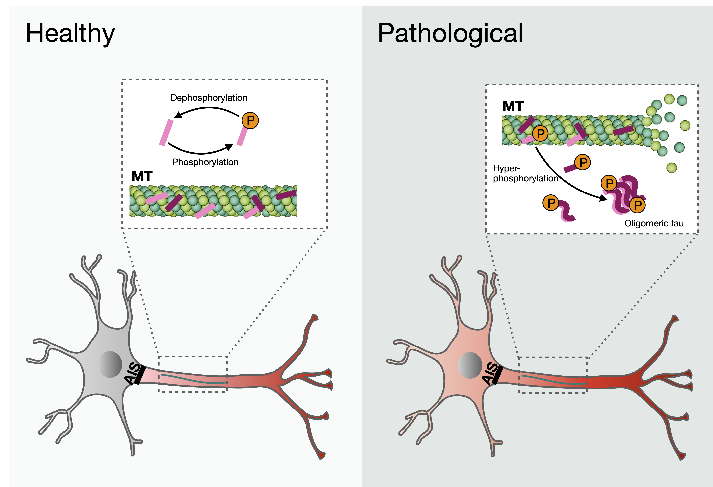

```{r setup, include=FALSE}
knitr::opts_chunk$set(echo = TRUE)
```

The connectivity between neurons in the brain underlies all function. Changes in the strength or number of these connections may underlie neurological disorders such as epilepsy or Alzheimers disease. Below I describe two areas of research in which we use mathematical modeling to understand the mechanisms underlying these two neurological diseases.


## Role of gap junctions in the generation and cessation of epileptic seizures

Epilepsy is a common neurological disorder affecting approximately many people around
the world. Epileptic activity in the brain is thought to result from an imbalance between excitation and inhibition. Recent experiments have shown that a particular type of connection between neurons, called a gap junction, may play a fundamental role in changing network dynamics during and after epileptic seizures. While many mathematical models of neurons coupled by gap junctions treat this connection as constant, more recent experiments have illuminated its dynamic behavior. In particular, experiments show that changes in the transjunctional voltage (voltage difference between cells) affect the gating properties of gap junctions. 

In this project, we develop a mathematical model that couples voltage dynamics and gap junction conductance to understand the potential effects of dynamics gap junctions over static ones in the context of epileptic seizures.


---
<div style="margin-top: 40px;"></div>

## Modeling the interaction of tau protein and neuron activity during neurodegenerative disease


 


In some neurodegenerative diseases, called tauopathies, the communication between neurons breaks down due to a buildup of a pathological form of the protein tau inside the neurons, leading to drastic changes in neuron activity and eventual cell death. While experiments show that the buildup of pathological tau can affect characteristics of neuron activity and neuron activity can influence the buildup of pathological (and healthy) tau protein, the mechanisms underlying this interdependent relationship remain unclear. Further, a buildup of pathological tau protein impacts intracellular transport of molecules that are necessary for neuronal communication, which also relies on neuronal activity, and breaks down during disease progression.


The goal of this project is to develop a mathematical modeling framework that will bridge the gap between the two scales (tau inside the neuron and synaptic connections between many neurons), using experimental results in the context of tau protein buildup and neuronal
voltage changes to constrain the model. 


Read more: 
 <a href="https://doi.org/10.1371/journal.pcbi.1007915" target="_blank">Building mechanistic models for the interaction of tau protein and neuronal voltage</a>. NSF EPSCoR R(2026-2027)
