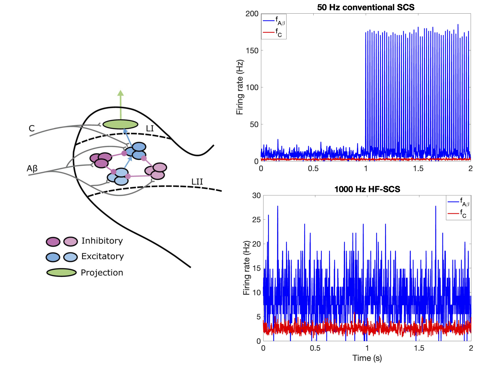
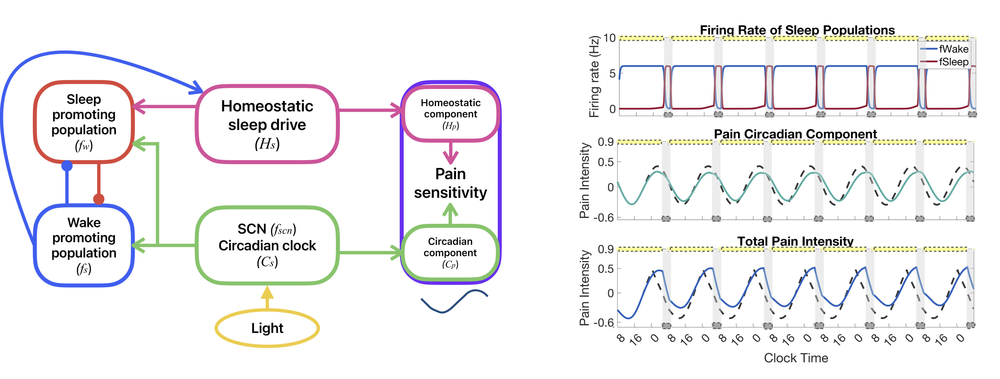

```{r setup, include=FALSE}
knitr::opts_chunk$set(echo = TRUE)
```
The processing of pain involves many neural circuits including those in the spinal cord, brainstem, thalamus, and cortex. When a nociceptive (painful) stimulus is applied, sensory neurons transmit the signal from the skin to the spinal cord. Populations of neurons in the spinal cord further process this signal before transmitting up to the cortex. This is joint work with Profs. <a href="https://sites.lsa.umich.edu/vbooth/" target="_blank">Victoria Booth</a> and  <a href="https://neuromodulation.bme.umich.edu" target="_blank">Scottt Lempka</a>. 

On this page, I will describe two main areas of research in which we have worked, or are in the process of working, to further understand mechanisms underlying pain processing in humans.


## Mechanisms of chronic pain and the alleviation of pain through spinal-cord stimulation
Chronic pain affects a large portion of the human population. However, symptoms and presentations of the condition are highly variable across individuals and **its causes remain
largely unknown**. A prevailing hypothesis for the cause of a typical chronic pain symptom
called allodynia is that the balance between excitatory and inhibitory signaling pathways
between neuron populations in the spinal cord dorsal horn may be disrupted. To help better understand neural mechanisms underlying allodynia, we analyze biologically-motivated mathematical models of subcircuits of neuron populations that are part of the pain
processing signaling pathway in the dorsal horn of the spinal cord. We use a **novel sensitivity analysis approach** to identify mechanisms of subcircuit dysregulation that may con-
tribute to two different types of allodynia. 

Read more: <a href="https://journals.plos.org/ploscompbiol/article?id=10.1371/journal.pcbi.1012234" target="_blank">Mechanisms for dysregulation of excitatory-inhibitory balance underlying allodynia in dorsal horn neural subcircuits.</a> *PLOS Comput. Bio.* (2025)

 

**Spinal cord stimulation (SCS)**, a process by which electrical stimulation is applied to the spinal cord, is a therapeutic treatment for chronic pain that is moderately effective, even when the underlying cause of the pain is unknown. There are several proposed mechanisms for how SCS may reduce pain; however, the strength and frequency of stimulation **vary per person**, and there is no way, as of yet, to determine a priori which method to use. We are working to use the spinal cord model, in conjunction with experiments on SCS, to develop an understanding for **how different SCS protocols might affect different spinal-cord circuits.**


Learn more: <a href= "https://app.dimensions.ai/details/grant/grant.15076970" target="_blank"> Modeling mechanisms of interindividual variation in pain modulation by spinal cord stimulation</a>. *NIH R15 Grant #R15AT013512.* (2025 - 2028)


---
<div style="margin-top: 40px;"></div>


## Pain sensitivity, circadian rhythms, and sleep

 

Circadian rhythms underlie many biological processes, including the regulation of immune cells that contribute to the processing of pain. As a result, **pain sensitivity exhibits a 24-hour rhythm**, with the highest sensitivity occurring during the middle of the night and lowest sensitivity occurring in the middle of the afternoon. In neuropathic patients, those who experience chronic pain usually accompanied by damaged nerve tissue, the sensitivity of pain follows a rhythm of opposite phase, with a peak occurring in the mid-afternoon. Unfortunately, mechanisms underlying this shift in rhythmicity for neuropathic pain patients remain unclear, leading to a need for further investigations into circadian modulation of pain processing. We use a mathematical model of the populations of neurons within the spinal cord to predict mechanisms in the processing of painful input that may change under neuropathic conditons.

Read more:<a href="https://doi.org/10.1371/journal.pcbi.1007106" target="_blank">Modeling the daily rhythm of human pain processing in the dorsal horn.</a> *PLOS Comput. Bio.* (2025)


**Sleep and pain have a complex relationship.** Rest is necessary for healing and reducing pain, but being in pain inhibits our ability to sleep. To further explore the interplay between these two essential systems, we connect our spinal-cord model of pain processing (from above) to a model for sleep dynamics. Using data from experiments measuring changes in pain sensitivity due to sleep deprivation, we develop a model connecting sleep and pain sensitivity. We then use this model to make predictions about how sleep deprivation due to jet lag or shift work may impact pain sensitivity.

Read more: <a href="https://doi.org/10.3389/fnins.2023.1166203" target="_blank">Modeling homeostatic and circadian modulation of human pain sensitivity.</a> *Front. in Neurosci.* (2023)


