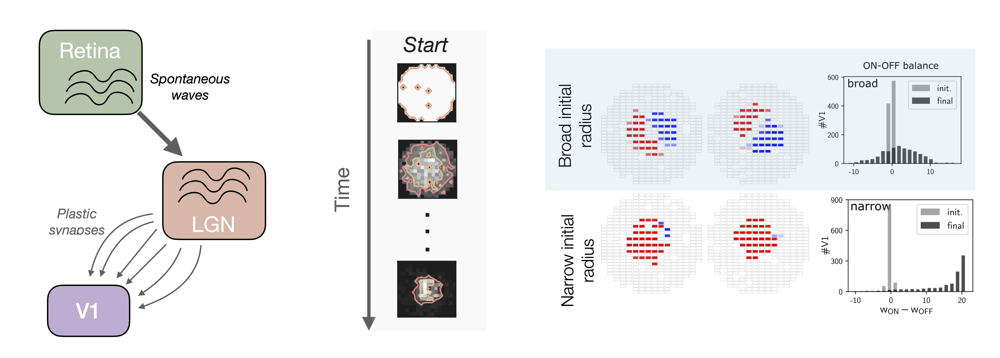
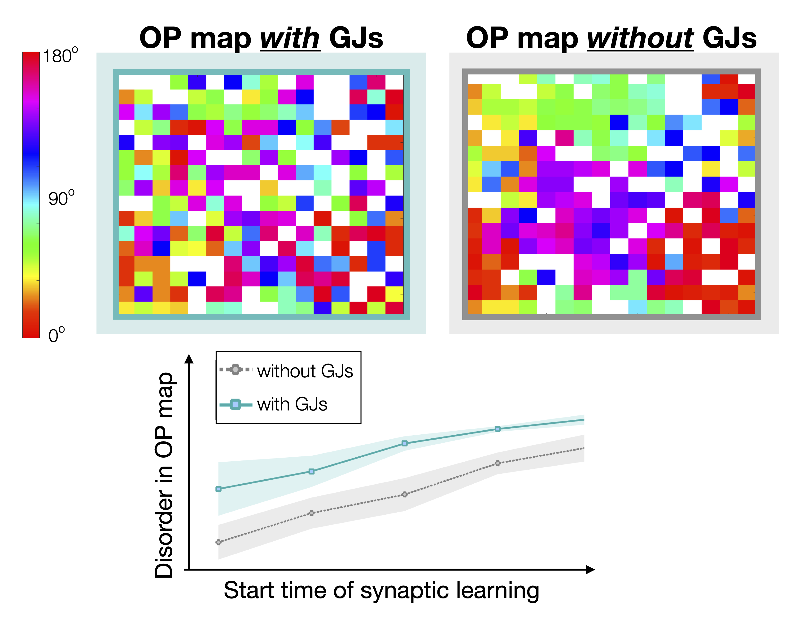

```{r setup, include=FALSE}
knitr::opts_chunk$set(echo = TRUE)
```
Neurons in the **developing cortex** communicate first through gap (or electrotonic) junctions, sites at which neurons directly pass ions and small molecules. As the brain develops, synaptic connections begin to form and largely replace the gap junctions as a means of communication among the excitatory neurons. Gap junctions among the inhibitory neurons remain and mediate signals among them in conjunction with the synaptic connections. 

In general, I am interested in the **interplay of GJs and synapses** in the developing visual cortex. Below are two completed projects in this area with links to published articles. 

Current open questions of interest to me in this area include the effect of inhibitory plasticity on orientation preference map formation, the co-location of synapses and GJs between inhibitory neurons and their interactions, and the role of GJs in developmental disorders of the visual system.  


## The role of retinal waves in the formation of receptive fields for neurons in the developing visual cortex

 

Spontaneous activity in the retina occurs throughout early development and is thought to drive the formation of synapses across visual areas in the brain. I am interested in using mathematical modeling to understand how changes in properties of retinal waves during development (e.g., wave speed and width) may impact the **formation of the receptive fields** of neurons in the primary visual cortex (V1). 

To do this, we developed a **large-scale, biologically-motivated model** including 1000 V1 neurons with spatio-temporal input along their synapses, the strength of which varies according to a spike-timing-dependent plasticity rule. We used this model to predict how RFs might change with different characteristics of the retinal waves. We then created a simpler, firing-rate model to understand the mechanisms underlying our predictions.  


Read more: 
 <a href="https://doi.org/10.1103/qr68-9vy9" target="_blank">Uncovering Potential Effects of Spontaneous Waves on Synaptic Development: The Visual System as a Model</a> (2025).

---
<div style="margin-top: 40px;"></div>

## The effect of gap junctions on the orientation-preference map formation

Some neurons in V1 of mammals preferentially respond to stimulus features such as the orientation angle of the edge of a stimulus. In higher-level mammals such as monkeys and cats, the visual cortex contains an ordered **map of the orientation preference (OP)** of each neuron where cells that prefer similar angles reside close to one another. In rodents, however, the map of orientation preference appears random and disordered, with little correlation between preferred orientation and location in cortical space. 

 


Experiments in mice reveal that neurons are transiently coupled by gap junctions during the first postnatal week, a time at which synaptic connections between neurons are not yet formed, and disappear by the time that OP is determined. In addition, the cells that were coupled by a gap junction during development, have an increased likelihood of forming a similar OP in adulthood, as well as a recurrent synaptic connection. I am interested in modeling the formation of the synaptic connections into and within the visual cortex during development and using this model to **reveal mechanisms underlying the creation of different orientation-preference maps across mammals**.  

Results of the model show that a disordered, “salt-and-pepper” OP map forms when gap junctions are introduced early in development and disappear over time, as expected. However, if the recurrent cortical synapses begin to form earlier in developmental time, the resulting orientation-preference map becomes more ordered, until it resembles that of a high-level mammal. The role of gap-junction coupling in the network seems to be in enhancing disorder in the orientation-preference map.


Read more: 
 <a href="https://doi.org/10.1371/journal.pcbi.1007915" target="_blank">Modeling the role of gap junctions between excitatory neurons in the developing visual cortex</a>. (2021)
