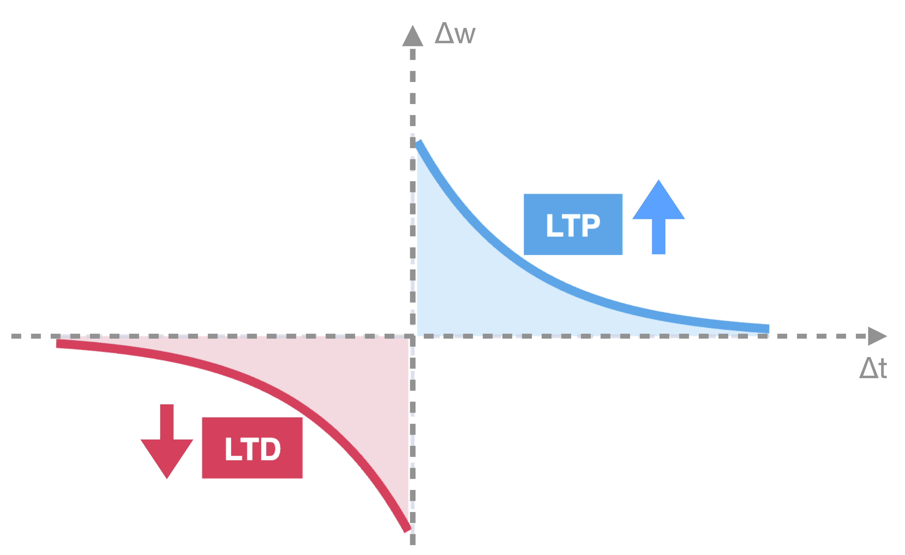
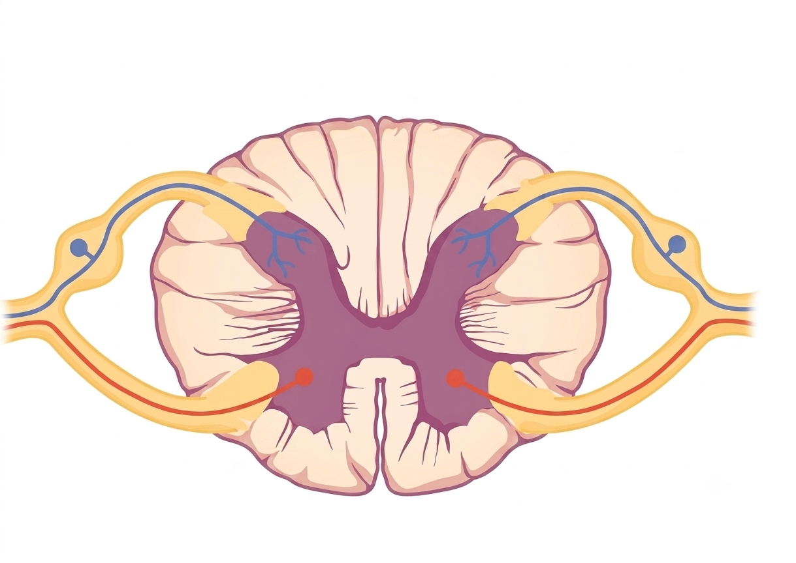
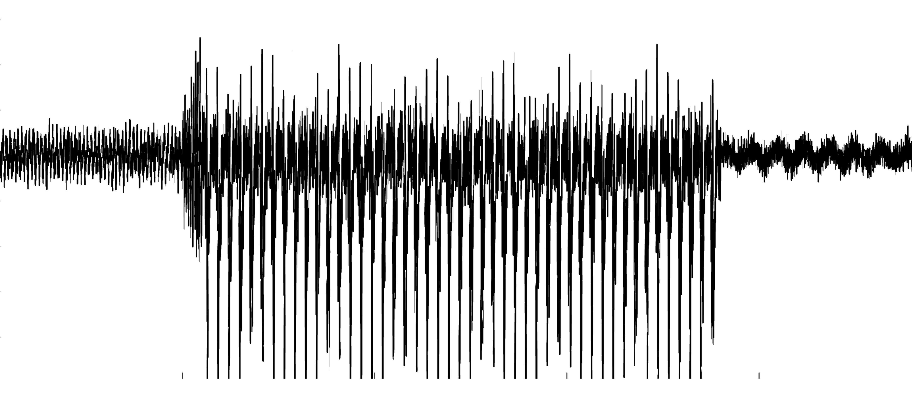

I am interested in using **mathematical modeling** to explore problems in neuroscience and propose plausible mechanisms underlying biological phenomena that may not be uncovered through experiments. My current work focuses on problems in three main areas (shown below).Click on each box to learn more about our modeling approaches and recent findings.


<br>

```{=html}
<style>
.project-tile {
  border: 1px solid #e0e0e0;
  border-radius: 8px;
  padding: 20px;
  text-align: center;
  transition: transform 0.2s, box-shadow 0.2s;
  background-color: #fafafa;
  height: 100%;
  cursor: pointer;
  text-decoration: none !important;
  color: #333 !important;
  display: block;
}

.project-tile:hover {
  transform: translateY(-5px);
  box-shadow: 0 10px 20px rgba(0,0,0,0.1);
  background-color: #ffffff;
}

.project-tile h3 {
  margin-top: 15px;
  font-size: 1.3em;
  color: #00539B;
  font-weight: bold;
}

.tile-image {
  width: 100%;
  height: 140px;
  object-fit: cover;
  border-radius: 4px;
}

.row-flex {
  display: flex;
  flex-wrap: wrap;
}
</style>

<div class="row row-flex">
  
<div class="col-md-4" style="margin-bottom: 20px;">
<a href="plasticityProjects.html" class="project-tile">

  
<h3>Synaptic Plasticity </h3>
<p>Exploring spontaneous activity waves, synaptic plasticity, and cortical development using computational models.</p>
</a>
</div>

<div class="col-md-4" style="margin-bottom: 20px;">
<a href="painProjects.html" class="project-tile">
  


<h3>Pain Processing Dynamics</h3>
<p>Modeling spinal cord dynamics, allodynia, and the circadian and homeostatic modulation of human pain sensitivity.</p>
</a>
</div>

<div class="col-md-4" style="margin-bottom: 20px;">
<a href="neuroDiseaseProjects.html" class="project-tile">
 
 
 
<h3>Neurological Disease </h3>
<p>Investigating mechanisms underlying epileptic seizures and neuronal degeneration.</p>
</a>
</div>
</div>
```

I very much enjoy working with **undergraduate students**, and I have hired several student research assistants to work on many components of these projects! If you are a Middlebury student interested in joining a project, feel free to reach out. 

*Please note that I typically require students to have taken Differential Equations (MATH 0226) before working with me.* 


